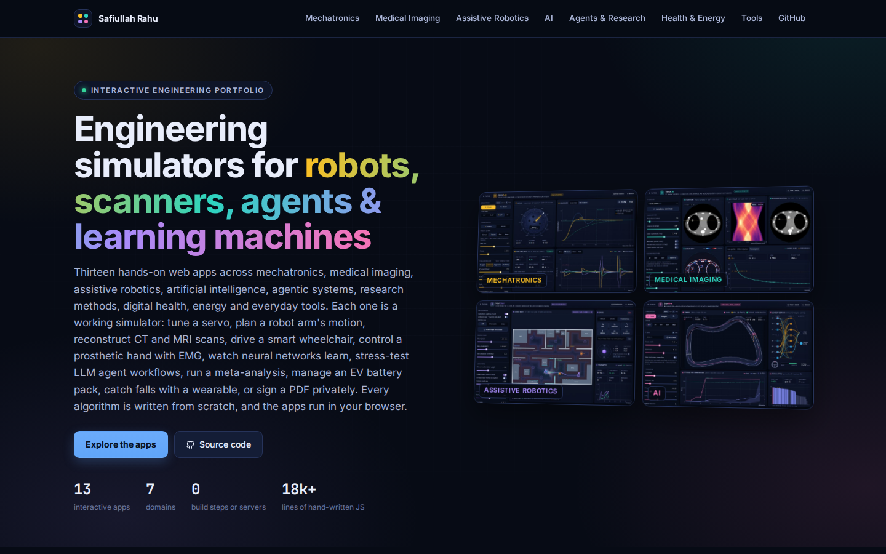
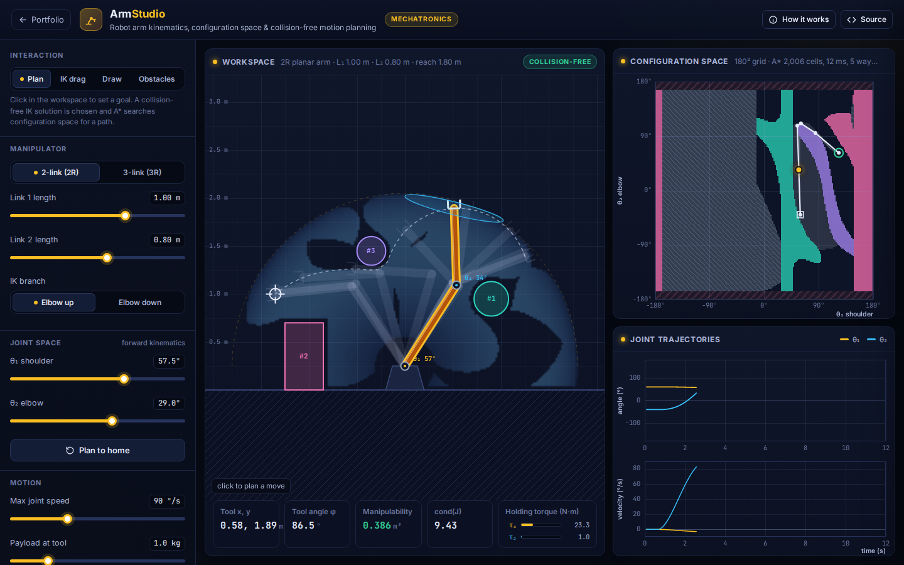
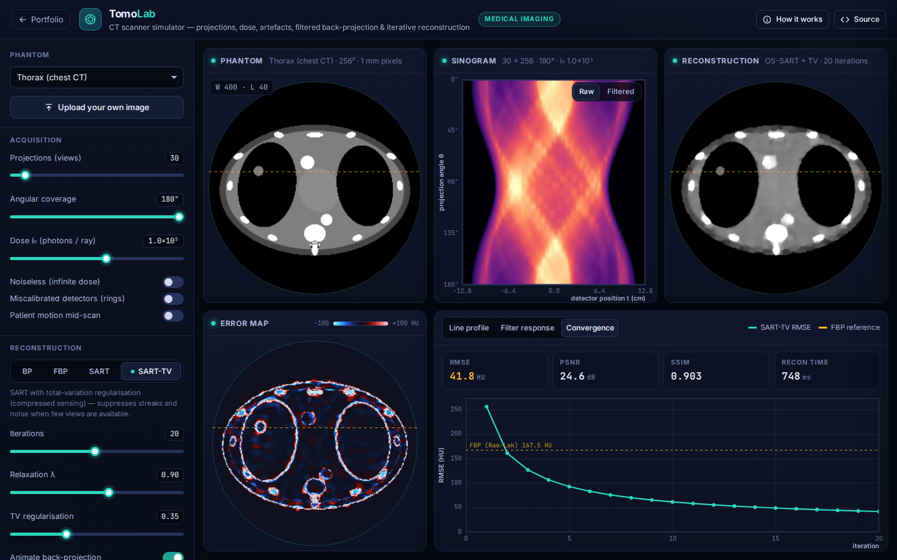
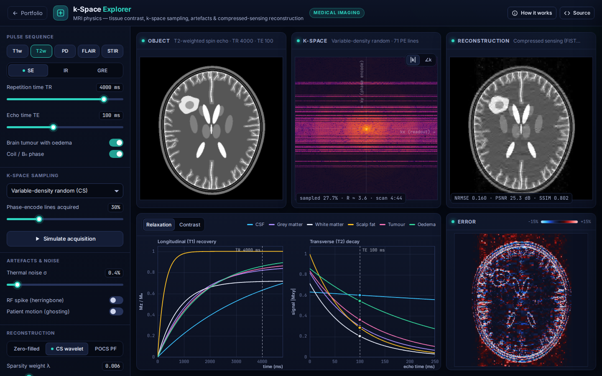
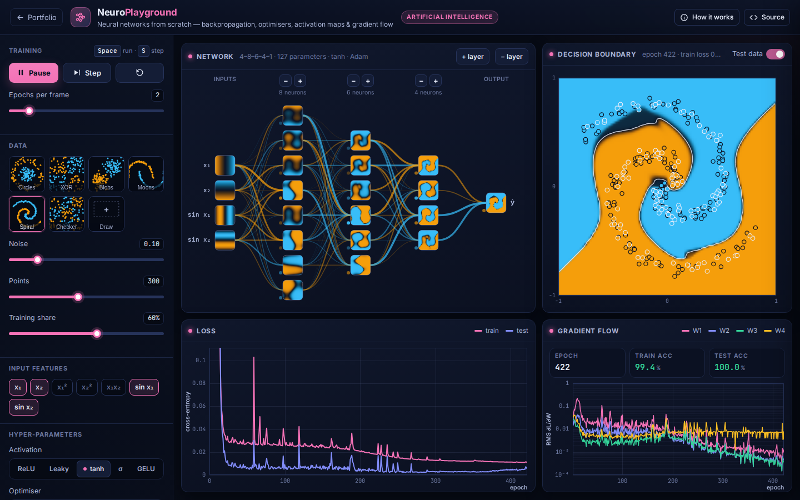
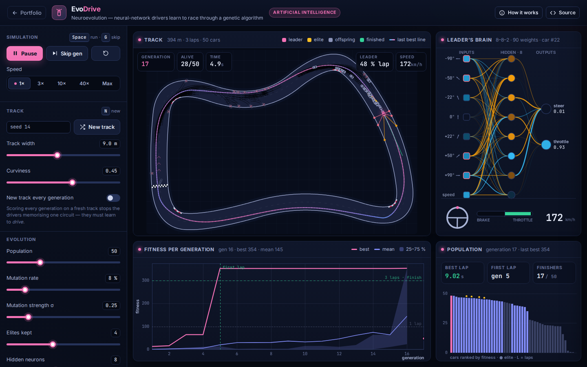
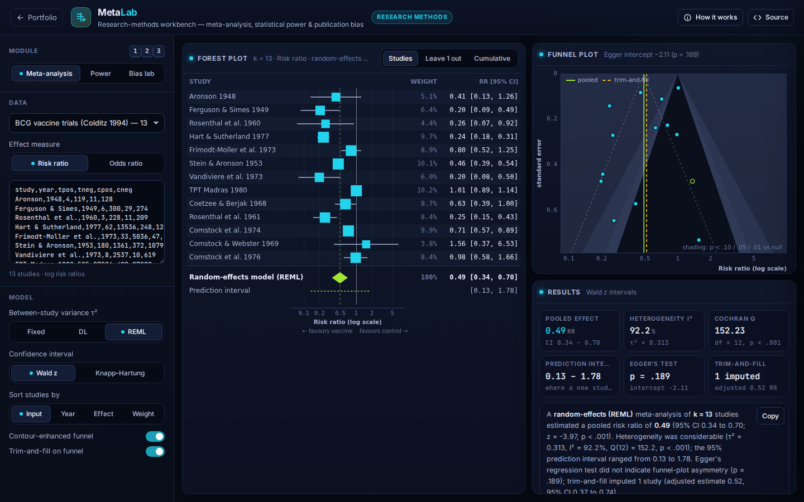
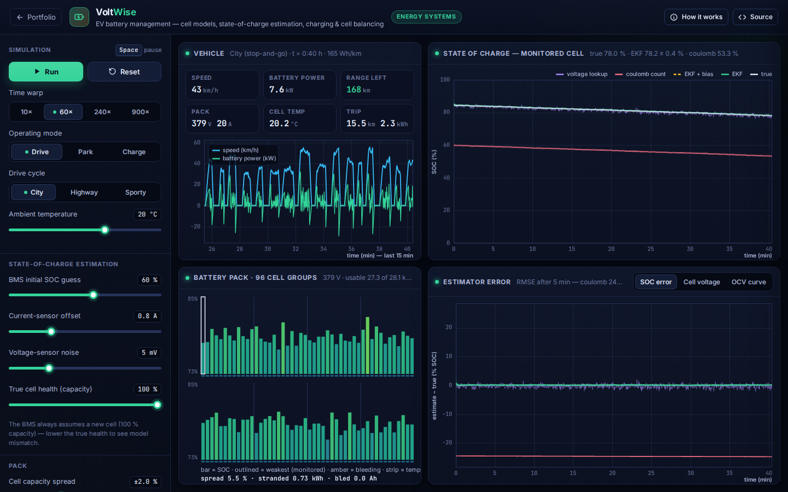
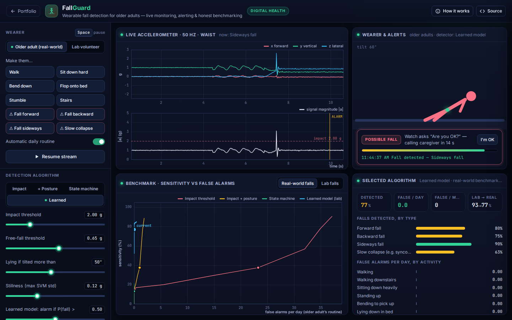
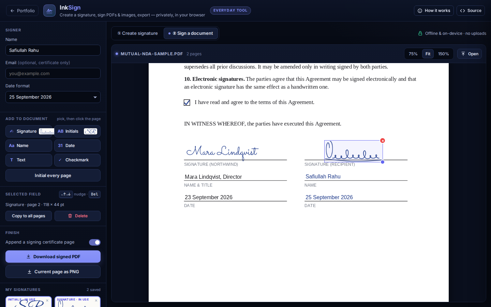

# Safiullah Rahu · Interactive Engineering Portfolio

**Thirteen interactive apps across Mechatronics, Medical Imaging, Assistive Robotics, AI, Agentic Systems & Research Methods, Connected Health & Energy, and Everyday Tools. They run in your browser.**

Each app is a working simulator of a real engineering problem. You can tune a servo loop, plan a robot arm's motion, reconstruct CT
and MRI scans, drive a smart wheelchair, control a prosthetic hand with muscle signals, or watch neural networks learn by
back-propagation and by evolution. Every algorithm is implemented from scratch in plain JavaScript, with no frameworks, no
numeric libraries and no build step, and each app's maths lives in a Node-tested core module. There is also a practical everyday
tool: **InkSign**, for creating a signature and signing PDFs privately in the browser.

**▶ Live portfolio: [safiullah-rahu.github.io/AI-Applications](https://safiullah-rahu.github.io/AI-Applications/)**
(served by GitHub Pages; see [deployment](#deploy-on-github-pages)). You can also open `index.html` locally.

[](https://safiullah-rahu.github.io/AI-Applications/)

| Domain | App | Highlights |
|---|---|---|
| ⚙️ Mechatronics | [**MotorLab**: PID servo tuning studio](mechatronics/pid-motor-lab/) | RK4 DC-motor physics · anti-windup PID · relay auto-tuning · Bode margins · pole map |
| ⚙️ Mechatronics | [**ArmStudio**: robot arm kinematics & C-space planner](mechatronics/robot-arm-studio/) | analytic and DLS inverse kinematics · manipulability · configuration space · A* motion planning |
| 🩻 Medical Imaging | [**TomoLab**: CT reconstruction lab](medical-imaging/ct-reconstruction-lab/) | analytic Radon transform · dose noise and artefacts · FBP · OS-SART · TV regularisation |
| 🧠 Medical Imaging | [**k-Space Explorer**: MRI physics & reconstruction](medical-imaging/mri-kspace-explorer/) | pulse-sequence contrast · k-space sampling · artefacts · compressed sensing (FISTA) · POCS |
| ♿ Assistive Robotics | [**NaviChair**: smart wheelchair navigator](assistive-robotics/smart-wheelchair-navigator/) | LIDAR · distance-transform costmap · A* · dynamic window · shared control · mapping |
| 🦾 Assistive Robotics | [**MyoHand**: EMG prosthetic hand controller](assistive-robotics/emg-prosthetic-hand/) | 8-channel sEMG · Hudgins features · LDA / k-NN / MLP · proportional hand control |
| 🤖 AI | [**NeuroPlayground**: neural networks from scratch](ai/neural-network-playground/) | back-propagation · Adam · activation maps · decision boundaries · gradient flow |
| 🤖 AI | [**EvoDrive**: neuroevolution self-driving cars](ai/neuroevolution-cars/) | genetic algorithm · ray sensors · grip-limited physics · procedural tracks · race the AI |
| 🧩 Agentic Systems | [**AgentFlow**: agentic workflow studio](agentic-research/agentflow/) | LLM-agent DAGs · discrete-event simulation · retries, timeouts, rate limits · critical path · Monte Carlo SLOs |
| 📊 Research Methods | [**MetaLab**: research synthesis, power & bias workbench](agentic-research/metalab/) | REML meta-analysis · forest & funnel plots · trim-and-fill · exact power · publication-bias simulation |
| 🔋 Energy Systems | [**VoltWise**: EV battery management system](health-energy/battery-bms/) | Thevenin cell model · drive cycles · SOC estimation with EKFs · CC-CV charging · cell balancing |
| 🩺 Digital Health | [**FallGuard**: wearable fall detection & alerting](health-energy/fallguard/) | accelerometer models · threshold / state-machine / learned detectors · alert escalation · sensitivity vs false alarms/day |
| ✍️ Everyday Tools | [**InkSign**: create a signature & sign documents](everyday-tools/inksign/) | draw / type / photo signatures · sign PDFs and photos · initials on every page · signing certificate with SHA-256 · 100 % on-device |

---

## ⚙️ Mechatronics

### MotorLab: PID Servo Tuning Studio
[](mechatronics/pid-motor-lab/)

This is a physics-based DC servo (electrical and mechanical dynamics, Coulomb friction, saturation, encoder quantisation) under
digital PID control. Tune position or velocity loops and capture and pin step responses with rise, overshoot, settling, error and IAE
metrics. The loop is also analysed in the frequency domain (Bode margins, closed-loop poles), and relay (Åström–Hägglund) or
model-based (FOPDT + SIMC) auto-tuners are included. **[Open app](mechatronics/pid-motor-lab/index.html) · [Details](mechatronics/pid-motor-lab/README.md)**

### ArmStudio: Robot Arm Kinematics & C-Space Planner
[](mechatronics/robot-arm-studio/)

This is a 2R/3R planar manipulator. Solve closed-form and damped-least-squares inverse kinematics, and see Yoshikawa manipulability
ellipses and gravity holding torques. Configuration-space obstacles are computed from exact capsule collision checks. Motion is
planned with A* on a 180² grid or 72³ lattice, then shortcut-smoothed and given quintic time scaling. There is also a draw
mode that turns the arm into a plotter. **[Open app](mechatronics/robot-arm-studio/index.html) · [Details](mechatronics/robot-arm-studio/README.md)**

## 🩻 Medical Imaging

### TomoLab: CT Reconstruction Lab
[](medical-imaging/ct-reconstruction-lab/)

This is the full chain of a parallel-beam CT scanner, from an analytic phantom and its Radon transform, through Poisson dose noise and metal, ring and
motion artefacts, to filtered back-projection (with a choice of windowed ramp filters), OS-SART or SART-TV. Results are compared with signed error
maps, RMSE in HU, PSNR and SSIM. **[Open app](medical-imaging/ct-reconstruction-lab/index.html) · [Details](medical-imaging/ct-reconstruction-lab/README.md)**

### k-Space Explorer: MRI Physics & Reconstruction
[](medical-imaging/mri-kspace-explorer/)

It uses a procedural brain with a tumour and oedema. Set spin-echo, inversion-recovery and gradient-echo contrast (T1w, T2w, PD, FLAIR, STIR), and
see and paint k-space, with undersampling patterns, RF-spike and motion artefacts. Reconstruct with zero-filling, compressed sensing
(FISTA + Haar wavelets) or POCS partial Fourier. **[Open app](medical-imaging/mri-kspace-explorer/index.html) · [Details](medical-imaging/mri-kspace-explorer/README.md)**

## ♿ Assistive Robotics

### NaviChair: Smart Wheelchair Shared-Control Navigator
[](assistive-robotics/smart-wheelchair-navigator/)

This is a powered wheelchair with a 360° LIDAR in an apartment with moving people. It plans with an exact distance-transform costmap and A*,
and follows the route with the Dynamic Window Approach, pure pursuit and docking. It has manual, shared (with tremor filtering) and
autonomous modes, takes voice-style commands ("take me to the kitchen") and builds a log-odds map as it drives.
**[Open app](assistive-robotics/smart-wheelchair-navigator/index.html) · [Details](assistive-robotics/smart-wheelchair-navigator/README.md)**

### MyoHand: EMG Prosthetic Hand Controller
[](assistive-robotics/emg-prosthetic-hand/)

This is the myoelectric pattern-recognition pipeline used in modern prostheses: 8-channel surface EMG synthesis, filtering, Hudgins
features, and LDA, k-NN or MLP classifiers evaluated on held-out repetitions. Decisions are smoothed by majority vote with rejection, and they drive an animated
robotic hand. Electrode shift, fatigue and interference show why recalibration matters.
**[Open app](assistive-robotics/emg-prosthetic-hand/index.html) · [Details](assistive-robotics/emg-prosthetic-hand/README.md)**

## 🤖 Artificial Intelligence

### NeuroPlayground: Neural Networks from Scratch
[](ai/neural-network-playground/)

Train a multilayer perceptron in your browser, with gradients checked against finite differences. It shows every neuron's activation map,
the decision boundary, loss curves and per-layer gradient flow, and includes experiments on vanishing gradients, overfitting and
feature engineering. **[Open app](ai/neural-network-playground/index.html) · [Details](ai/neural-network-playground/README.md)**

### EvoDrive: Neuroevolution Self-Driving Cars
[](ai/neuroevolution-cars/)

A population of neural-network drivers learns to race on procedurally generated circuits by selection, crossover and mutation. There is no
gradient and no training data. The cars have ray-cast sensors, grip-limited physics that forces them to learn braking, and a live
brain view. You can test generalisation on new tracks, then race the champion yourself.
**[Open app](ai/neuroevolution-cars/index.html) · [Details](ai/neuroevolution-cars/README.md)**

## 🧩 Agentic Systems & 📊 Research Methods

### AgentFlow: Agentic Workflow Studio
[](agentic-research/agentflow/)

Design LLM-agent pipelines as graphs: planners, parallel tool calls, reflection loops, routers and human approval. A discrete-event
simulator runs thousands of executions with realistic latency, token cost and failures, under retries with jittered backoff, timeouts,
model fallback, a provider rate limit and caching. It reports the success rate, p50/p95 latency and cost per run, and critical-path analysis
shows which step to optimise. Includes deep-research, support-triage, coding-agent and multi-agent-debate workflows, A/B baselines,
an execution trace and JSON import/export. **[Open app](agentic-research/agentflow/index.html) · [Details](agentic-research/agentflow/README.md)**

### MetaLab: Research Synthesis, Power & Bias Workbench
[](agentic-research/metalab/)

This is the statistics of evidence synthesis. It runs fixed- and random-effects meta-analysis (DerSimonian–Laird, REML, Knapp–Hartung) with forest plots,
contour-enhanced funnel plots, Egger's test, trim-and-fill, leave-one-out and cumulative views, and it writes the results paragraph for you.
It also does exact power analysis with the non-central t and a Monte Carlo check, and simulates how the file drawer and p-hacking
distort a literature. Its results match R's metafor and G*Power. **[Open app](agentic-research/metalab/index.html) · [Details](agentic-research/metalab/README.md)**

## 🔋 Connected Health & Energy

### VoltWise: EV Battery Management System
[](health-energy/battery-bms/)

Drive an EV through city, highway and sporty cycles on a 96-cell pack of equivalent-circuit Li-ion cells with thermal behaviour and
manufacturing spread. Four state-of-charge estimators run side by side: coulomb counting, voltage lookup, an extended Kalman filter
with a ±3σ band, and an EKF that learns the current-sensor offset. You can inject a wrong initial SOC, sensor bias, noise and cell ageing, then charge
with CC-CV and watch passive balancing recover capacity stranded by the weakest cell.
**[Open app](health-energy/battery-bms/index.html) · [Details](health-energy/battery-bms/README.md)**

### FallGuard: Wearable Fall Detection & Alerting
[](health-energy/fallguard/)

A waist-worn accelerometer streams an older adult's day. Four detectors (impact threshold, posture checks, the classic free-fall state
machine and a learned model) drive an "Are you OK?" countdown and caregiver escalation. The benchmark reproduces a known real-world
finding: algorithms tuned on simulated lab falls lose much of their sensitivity on real falls of older adults, and every threshold trades
missed falls for false alarms per day. **[Open app](health-energy/fallguard/index.html) · [Details](health-energy/fallguard/README.md)**

## ✍️ Everyday Tools

### InkSign: Create a Signature & Sign Documents
[](everyday-tools/inksign/)

A private, free alternative to e-signature websites for everyday paperwork: leases, offer letters, NDAs, forms and permission slips.
Draw a signature with speed-sensitive pen strokes, type it in one of five handwriting fonts, or photograph it on paper (lighting is
flattened and Otsu thresholding removes the paper). Then open a PDF or a photo of a document and place your signature, initials (on every page
in one click), name, date, text and checkmarks. You get back the original PDF with the fields added, plus an optional signing certificate
page recording the time, time zone, fields and the SHA-256 fingerprint of the original. Signatures also export as transparent PNG, SVG or to the clipboard.
Nothing is uploaded. **[Open app](everyday-tools/inksign/index.html) · [Details](everyday-tools/inksign/README.md)**

---

## Engineering notes

- **Written from scratch.** FFTs, Radon transforms, reconstruction algorithms, distance transforms, planners, classifiers,
  back-propagation, the genetic algorithm, the discrete-event agent simulator and the meta-analytic estimators are all hand-written. The source is meant to be read.
  The one exception is InkSign, which uses vendored copies of Mozilla's pdf.js (to render PDFs) and pdf-lib (to write them), both open source.
- **Separated cores.** Each app keeps its maths in a DOM-free `*-core.js` module (loadable in Node or the browser) and its UI
  in `app.js`. The design system and plotting live in [`shared/`](shared/).
- **Tested.** [`tests/run-tests.js`](tests/run-tests.js) checks the cores against analytic results, brute-force references, finite differences and reference software (metafor, G*Power).
  It runs 61 tests covering all 13 apps in about 7 s with no dependencies.
- **Static and portable.** The apps are plain HTML, CSS and JS with self-hosted fonts. They work from `file://`, any static server or GitHub Pages,
  offline, with no API keys.

## Run locally

```bash
git clone https://github.com/Safiullah-Rahu/AI-Applications.git
cd AI-Applications
# either open index.html directly in a browser, or serve the folder:
python3 -m http.server 8000     # then visit http://localhost:8000
```

Run the tests (Node.js 18 or later):

```bash
node tests/run-tests.js          # or: npm test
```

Regenerate the screenshots with headless Chromium:

```bash
npm i -D playwright && npx playwright install chromium
node tools/screenshots.js
```

## Deploy on GitHub Pages

1. **Settings → Pages → Build and deployment → Deploy from a branch.**
2. Choose branch `main` and folder `/ (root)`, then save.
3. After a minute the portfolio is live at `https://safiullah-rahu.github.io/AI-Applications/`.

The empty `.nojekyll` file tells Pages to serve the files as they are.

## Repository layout

```
index.html                     portfolio hub page
shared/                        design system (lab.css), fonts, LabMath numerics, Lab UI and plotting
mechatronics/
  pid-motor-lab/               MotorLab
  robot-arm-studio/            ArmStudio
medical-imaging/
  ct-reconstruction-lab/       TomoLab
  mri-kspace-explorer/         k-Space Explorer
assistive-robotics/
  smart-wheelchair-navigator/  NaviChair
  emg-prosthetic-hand/         MyoHand
ai/
  neural-network-playground/   NeuroPlayground
  neuroevolution-cars/         EvoDrive
agentic-research/
  agentflow/                   AgentFlow
  metalab/                     MetaLab
health-energy/
  battery-bms/                 VoltWise
  fallguard/                   FallGuard
everyday-tools/
  inksign/                     InkSign
tests/run-tests.js             core-module test suite
tools/screenshots.js           screenshot generator (Playwright)
screenshots/                   README and hub images
```
