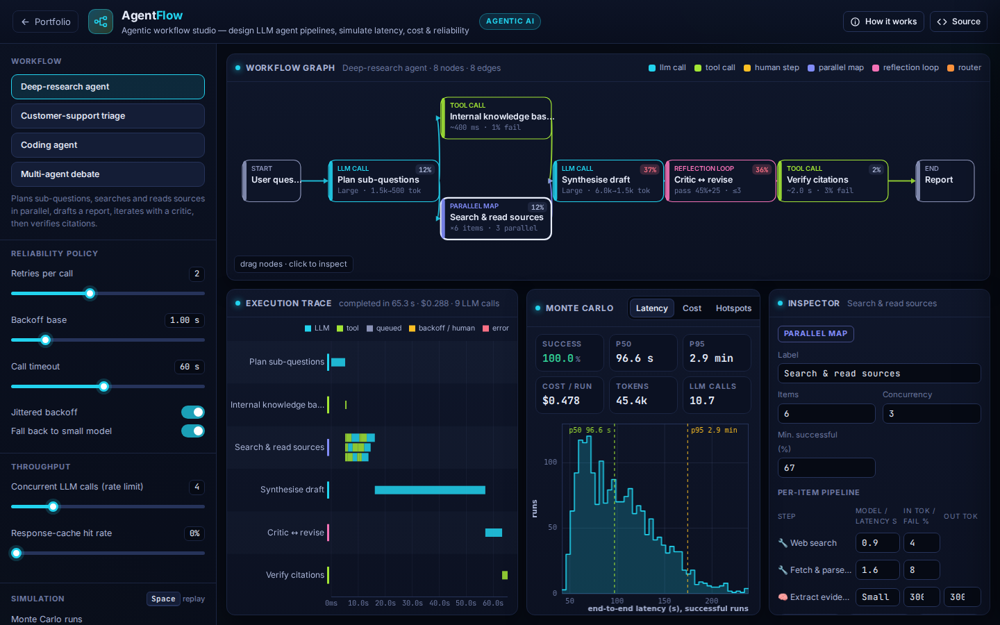
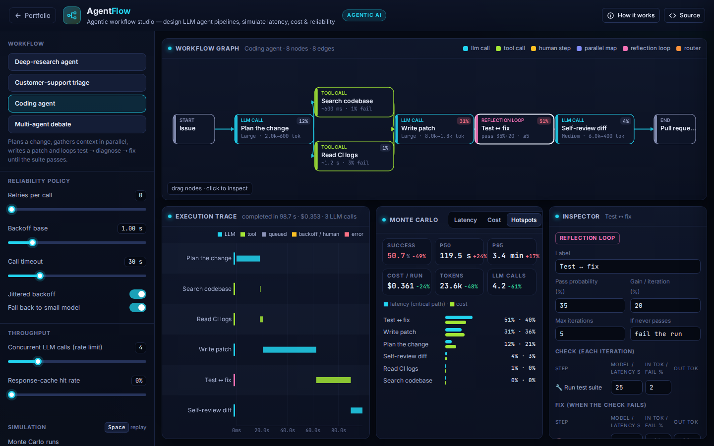

# AgentFlow: Agentic Workflow Studio

**Agentic Systems** · [▶ Live demo](https://safiullah-rahu.github.io/AI-Applications/agentic-research/agentflow/) · [← Portfolio](../../README.md)

Production LLM-agent systems are distributed systems. A single request can fan out into dozens of model and tool calls, each with
variable latency, a price and a chance of failing. AgentFlow lets you design an agent workflow as a graph and measures how it
behaves *as a system* with a discrete-event simulation: tail latency, cost per run, success rate and where the time goes.
You can explore all of this before spending anything on API calls.

## Features

- **Building blocks**:
  - LLM calls: model tier, prompt and completion tokens.
  - Tool calls: log-normal latency and a failure rate.
  - Human steps: heavy-tailed waits.
  - Parallel maps: fan-out over N items with a concurrency limit and a minimum success fraction.
  - Reflection loops: check → fix → check, with pass probability rising per iteration.
  - Routers: probabilistic branching; joins wait only for active branches.
- **Four reference workflows**: a deep-research agent, customer-support triage with human escalation, a coding agent
  with a test → fix loop, and a multi-agent debate with a judge.
- **Reliability policy**:
  - Retries with exponential backoff and jitter.
  - Per-call timeouts. Timed-out requests are still billed for their input tokens.
  - Fallback to a smaller model after the last retry.
- **Throughput**: a global concurrency limit (provider rate limit) with queueing, and a response-cache hit rate.
- **Replay**: animate a single execution on the graph, with a Gantt trace that shows every call, queue wait, backoff and error,
  plus a span table in the style of OpenTelemetry.
- **Monte Carlo analytics**: 500–5,000 seeded runs give success rate, p50/p95 latency, cost, tokens and calls per run,
  and latency and cost histograms.
- **Critical-path attribution**: each node's share of end-to-end latency, next to its share of cost.
- **A/B comparison**: pin a baseline, change the design and see the deltas.
- **Editing**: drag nodes, edit every parameter in the inspector, and export or import workflows as JSON.

## How it works

| Piece | Method |
|---|---|
| Scheduler | discrete-event simulation over a binary-heap event queue; a node starts when all active predecessors finish (fork/join) |
| LLM latency | `TTFT · e^{σZ} + tokens_out / throughput`, with log-normal token counts; cost = tokens × tier price |
| Rate limit | global semaphore on concurrent LLM calls; queued time is recorded as its own span |
| Retries | `wait_k = base · 2^k · U(0.5, 1.5)` (exponential backoff with full jitter), then an optional small-model fallback |
| Critical path | walk back from the end node through the predecessor that finished last; node durations along that chain sum to the end-to-end latency |

The core is checked against closed-form results: with failure probability *p* and *r* retries, the simulated success rate
matches `1 − p^(r+1)`.

## Things to try

1. Set retries to 0 in the research agent. Success drops from about 100 % to about two-thirds.
2. Lower the timeout to 30 s. Long generations time out, get retried and fall back to the small model.
3. In the debate preset, set concurrency to 1 and watch the "parallel" agents serialise.
4. In support triage, the human branch dominates p95. Pin a baseline, then lower its routing share.

Model tiers and prices are illustrative, not quotes from any provider.

## Files

| File | Purpose |
|---|---|
| `agent-core.js` | Event queue, workflow validation, simulator, Monte Carlo aggregation and presets (no DOM, tested in Node) |
| `app.js` | Graph editor and replay, Gantt trace, inspector and analytics |
| `index.html` | Layout and the in-app notes |
