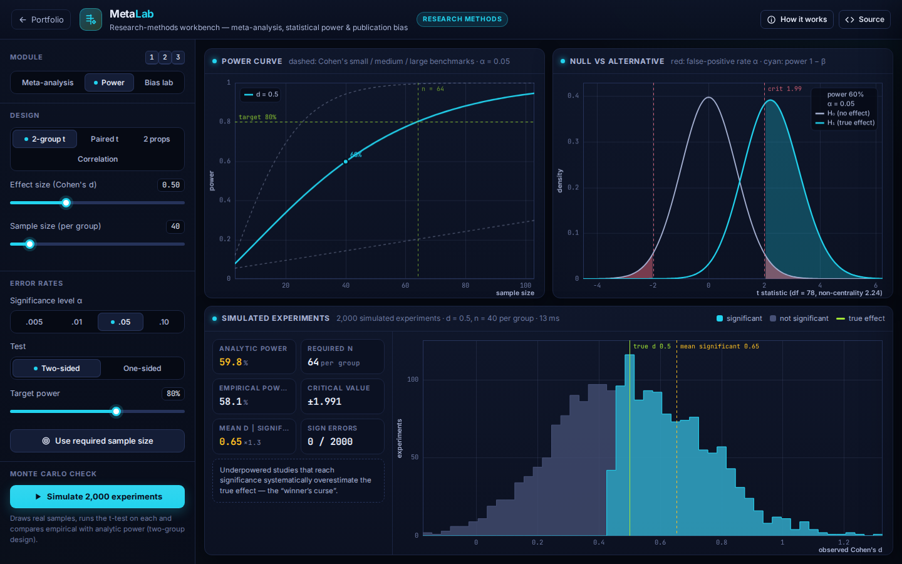
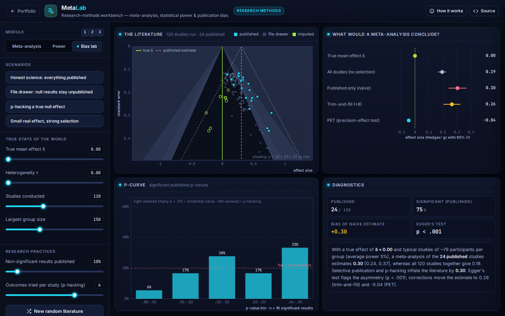

# MetaLab: Research Synthesis, Power & Bias Workbench

**Research Methods** · [▶ Live demo](https://safiullah-rahu.github.io/AI-Applications/agentic-research/metalab/) · [← Portfolio](../../README.md)

MetaLab covers the statistics behind evidence synthesis and study design. It has three modules: meta-analysis,
power analysis, and a lab that simulates how publication bias and p-hacking distort a whole research literature.
Every distribution function and estimator is implemented from scratch and checked against reference software.

## Modules

### 1 · Meta-analysis
- **Data**:
  - The classic BCG vaccine trials (Colditz et al., 1994).
  - A simulated literature of standardised mean differences.
  - Your own CSV: effect sizes and variances, 2×2 counts, or group means and SDs. Log risk/odds ratios and Hedges' g are computed automatically.
- **Models**: fixed effect, DerSimonian–Laird and REML (Fisher scoring), with Wald or Knapp–Hartung intervals.
- **Heterogeneity**: τ², I², Cochran's Q and a prediction interval.
- **Plots**: a forest plot with weights, the pooled diamond and the prediction interval, plus leave-one-out and cumulative views.
- **Small-study effects**:
  - A contour-enhanced funnel plot.
  - Egger's regression test.
  - Duval & Tweedie trim-and-fill (L₀ estimator), with the imputed studies drawn in.
- **Reporting**: an auto-generated methods-and-results paragraph, ready to copy.

### 2 · Power & sample size
- Two-sample and paired t-tests with **exact non-central t** power, two proportions, and correlations (Fisher z).
- Power curves against Cohen's benchmarks, the required sample size for a target power, and null-versus-alternative distributions with α and power shaded.
- **Monte Carlo check**: simulate 2,000 real experiments, compare empirical with analytic power, and see the *winner's curse*
  (significant results from underpowered studies overestimate the true effect).

### 3 · Bias lab
- Simulate a whole field: true effects θᵢ ~ 𝒩(δ, τ²), random study sizes, selective publication of non-significant results,
  and p-hacking by reporting the best of several outcomes.
- Compare what four analyses conclude: all studies, a naive meta-analysis of the published ones, trim-and-fill and PET.
- A p-curve of the published significant p-values, and scenario presets such as "p-hacking a true null effect".

## Validation

Checked in [`tests/run-tests.js`](../../tests/run-tests.js):

| Check | Reference | MetaLab |
|---|---|---|
| BCG, REML pooled log RR | metafor: −0.7145 | −0.7145 |
| BCG, REML τ² / I² | metafor: 0.3132 / 92.22 % | 0.3132 / 92.22 % |
| BCG, DL τ² · FE estimate | metafor: 0.3088 · −0.4303 | 0.3088 · −0.4303 |
| Power, d = 0.5, n = 64 per group | G*Power: 0.8015 | 0.8015 |
| Required n, d = 0.5, 80 % power | 64 per group | 64 |

## Files

| File | Purpose |
|---|---|
| `meta-core.js` | Normal, t, χ² and non-central t distributions; effect sizes; FE/DL/REML meta-analysis; Egger; trim-and-fill; PET; power; simulations; BCG data (no DOM, tested in Node) |
| `app.js` | The three modules, forest and funnel plots, charts and the report generator |
| `index.html` | Layout, the in-app notes and the CSV format |
