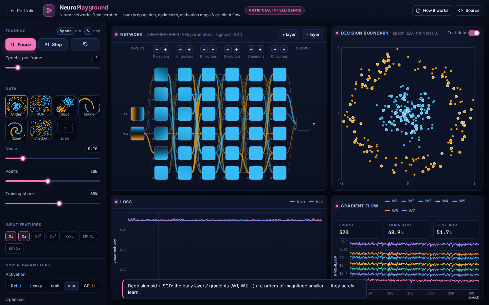

# NeuroPlayground: Neural Networks from Scratch

**Artificial Intelligence** · [▶ Live demo](https://safiullah-rahu.github.io/GPT-Applications/ai/neural-network-playground/) · [← Portfolio](../../README.md)

NeuroPlayground trains a multilayer perceptron in the browser and shows what every part of it is doing.
The network, back-propagation, optimisers and visualisations are about 400 lines of plain JavaScript, and the gradients are checked against finite differences.

## Features

- **Data**: circles, XOR, Gaussian blobs, moons, a two-arm spiral and a checkerboard, with adjustable noise, size and train/test split.
  You can also *draw your own* dataset by clicking.
- **Input features**: x₁, x₂, x₁², x₂², x₁x₂, sin x₁ and sin x₂. Toggle them to see how feature engineering compares with extra depth.
- **Architecture**: up to 6 hidden layers, added and removed from the diagram. Activations are ReLU, Leaky ReLU, tanh, sigmoid and GELU,
  with matching He or Xavier initialisation.
- **Training**: SGD, Momentum or Adam, mini-batches, learning rate and L2 regularisation.
- **Visualisations**:
  - The activation map of every neuron over the input square, with edges coloured by weight sign and scaled by magnitude.
  - The decision boundary with training and test points.
  - Loss curves.
  - Per-layer RMS gradient flow on a log scale.
- **Guided experiments**: vanishing gradients, feature engineering, overfitting and a deep GELU spiral.

## How it works

| Piece | Method |
|---|---|
| Forward | `z⁽ˡ⁾ = W⁽ˡ⁾ a⁽ˡ⁻¹⁾ + b⁽ˡ⁾`, `a⁽ˡ⁾ = φ(z⁽ˡ⁾)`, `ŷ = σ(z⁽ᴸ⁾)` |
| Loss | binary cross-entropy + `(λ/2)‖W‖²` |
| Backward | `δ⁽ᴸ⁾ = ŷ − y`, `δ⁽ˡ⁾ = (W⁽ˡ⁺¹⁾ᵀ δ⁽ˡ⁺¹⁾) ⊙ φ′(z⁽ˡ⁾)`, `∂L/∂W⁽ˡ⁾ = δ⁽ˡ⁾ a⁽ˡ⁻¹⁾ᵀ` |
| Adam | bias-corrected moment estimates, `w ← w − η m̂ / (√v̂ + ε)` |

## Things to try

1. Solve the spiral with only x₁ and x₂, then add the sin features and remove layers.
2. Run the vanishing-gradient experiment and watch the early layers' gradients collapse. Then switch to ReLU and Adam.
3. Pick the *Draw* dataset and create your own problem (Shift+click for the second class).

## Files

| File | Purpose |
|---|---|
| `nn-core.js` | MLP, activations, back-propagation, optimisers, features and datasets (no DOM, tested in Node) |
| `app.js` | Training loop, network diagram, activation maps and plots |
| `index.html` | Layout and the in-app notes |
