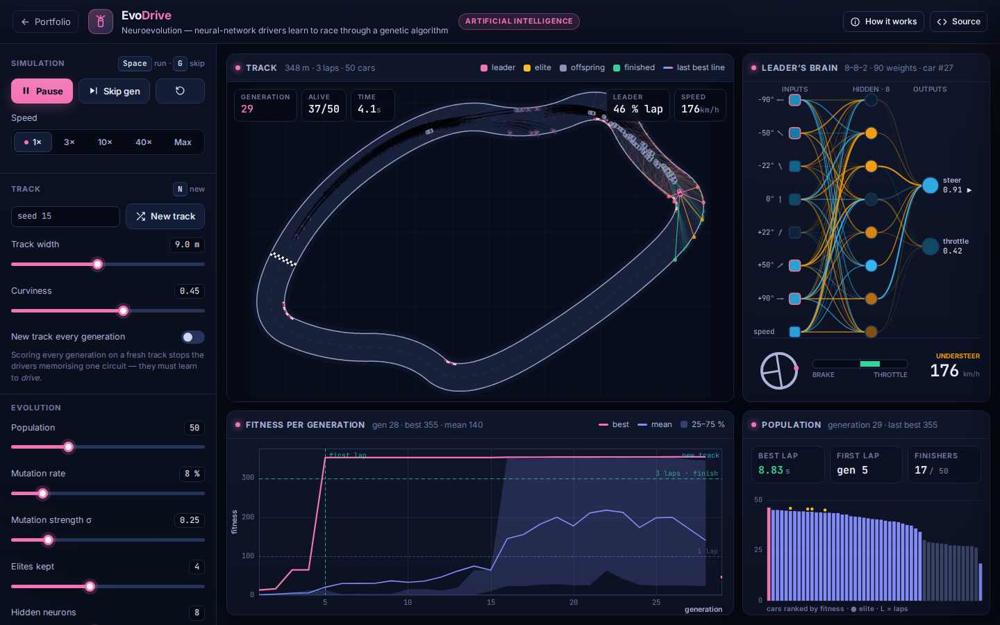

# EvoDrive: Neuroevolution Self-Driving Cars

**Artificial Intelligence** · [▶ Live demo](https://safiullah-rahu.github.io/GPT-Applications/ai/neuroevolution-cars/) · [← Portfolio](../../README.md)

EvoDrive trains neural-network drivers without gradients and without training data. A population of cars drives the same
circuit at the same time. Each car's network is one flat vector of numbers, its *genome*. After every generation the
better drivers are more likely to become parents, so good driving spreads through the population. It typically takes 3–15
generations before a car completes a lap, and lap times keep improving after that.

## Features

- **Procedural circuits**: the convex hull of random points, with displaced edge midpoints and Chaikin smoothing. Layouts are validated for
  corner radius and self-clearance, and red-and-white kerbs are drawn on tight corners.
- **Sensing**: 7 ray sensors (±90°, ±50°, ±22°, 0°) are cast with an exact Amanatides–Woo walk over a spatial hash of the wall segments,
  plus the car's own speed.
- **Brain**: a fully connected `8 → H → 2` tanh network that outputs steering and throttle/brake. The leader's brain is drawn live,
  with edges coloured by weight sign and highlighted by the signal flowing through them.
- **Physics**: a kinematic bicycle model with a tyre-grip limit. A car that enters a corner too fast understeers, runs wide and leaves skid marks,
  so good drivers learn to brake.
- **Genetic algorithm**: elitism, tournament selection, uniform crossover and Gaussian mutation, all adjustable live.
- **Charts**: best, mean and interquartile fitness per generation, plus a live ranking of the population.
- **Generalisation**: send the population to a *new track* to see whether it learned to drive or only memorised one circuit.
  Turn on *new track every generation* to breed drivers that generalise.
- **Race the champion**: drive a car yourself with the arrow keys or WASD against the evolved champion.
- **Save and load brains** as JSON, or start from a **pre-trained driver** that completes 59 of 60 unseen random tracks.

## How it works

| Piece | Method |
|---|---|
| Kinematics | `ψ̇ = v / L · tan δ`, clamped to `|ψ̇| ≤ a_lat / v` (grip limit), `v̇ = a_throttle − c_d · v` |
| Fitness | `100 ·` furthest progress in laps `+ [finished] · 100 · (1 − t / t_max)` |
| Selection | tournament (k = 3) with the top genomes copied unchanged (elites) |
| Variation | uniform crossover, and each weight is perturbed with probability p by 𝒩(0, σ²) |
| Pre-trained driver | domain-randomised evolution (4 random tracks per generation, 300 generations), selected on 30 validation tracks: [`tools/train-driver.js`](tools/train-driver.js) |

## Things to try

1. Let it solve the track, then press **New track**. Some champions generalise; others only memorised one circuit.
2. Lower the tyre grip. The drivers now have to learn to brake before corners.
3. Try 2 hidden neurons, or a very high mutation strength, and compare how fast the population learns.
4. Race the champion yourself.

## Files

| File | Purpose |
|---|---|
| `evo-core.js` | Track generator, ray casting, network, car physics, fitness and genetic algorithm (no DOM, tested in Node) |
| `app.js` | Evolution loop, race mode, rendering and charts |
| `pretrained.js` | The pre-trained driver (90 weights) |
| `tools/train-driver.js` | Reproduces `pretrained.js` with Node.js (`node ai/neuroevolution-cars/tools/train-driver.js`) |
| `index.html` | Layout and the in-app notes |
