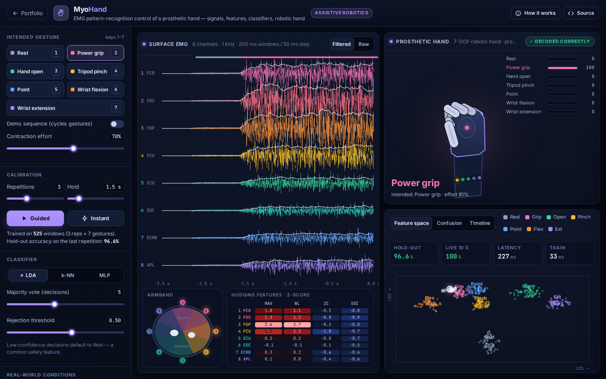
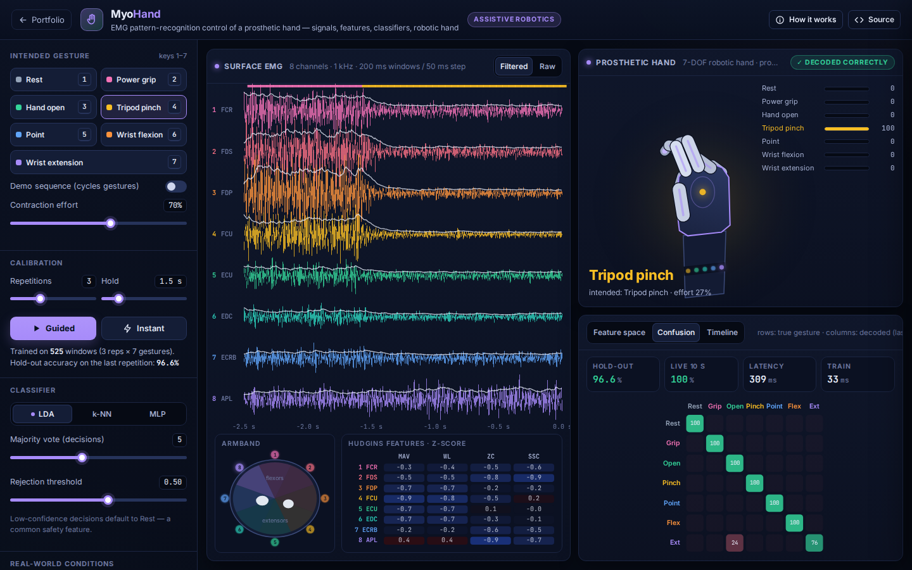

# MyoHand: EMG Prosthetic Hand Controller

**Assistive Robotics** · [▶ Live demo](https://safiullah-rahu.github.io/GPT-Applications/assistive-robotics/emg-prosthetic-hand/) · [← Portfolio](../../README.md)

Modern upper-limb prostheses are controlled by surface electromyography (sEMG). Electrodes on the residual forearm pick up
the activity of muscles the user can still contract. MyoHand reproduces the full pattern-recognition pipeline used in
research and clinical systems: signal → conditioning → features → classifier → decision smoothing → hand control.

## Features

- **Signal model**: 8 electrodes around the forearm. Each gesture recruits a characteristic muscle synergy. Channels are band-limited
  noise modulated by smooth activations, with repetition-to-repetition and effort variability.
- **Real-world conditions**: electrode shift (armband rotation), fatigue (median-frequency shift), electrode noise, 50 Hz
  mains interference with an optional notch filter, and motion artefacts.
- **Features**: the Hudgins time-domain set per channel (MAV, WL, ZC, SSC), giving a 32-D vector z-scored with calibration statistics.
- **Classifiers**:
  - Shrinkage LDA (the clinical workhorse).
  - k-NN.
  - A 32→24→7 MLP trained in the browser with Adam.
- **Honest evaluation**: accuracy is measured on the last calibration repetition, never on randomly split correlated windows.
  A confusion matrix and a Fisher-LDA feature-space projection are shown.
- **Control**: majority voting, confidence-based rejection to Rest, proportional speed control, and a 3-D robotic hand renderer.
- **Calibration**: guided (follow the prompts) or instant.

## How it works

| Piece | Method |
|---|---|
| Conditioning | 20 Hz RBJ biquad high-pass, optional 50 Hz notch |
| Features | `MAV = (1/N) Σ|xᵢ|`, `WL = (1/N) Σ|xᵢ − xᵢ₋₁|`, zero crossings, slope-sign changes |
| LDA | Gaussian classes with a shared covariance shrunk towards its diagonal |
| Decision | 5-window majority vote with a rejection threshold on the posterior |

## Things to try

1. Rotate the armband by half an electrode. Accuracy collapses, and recalibrating recovers it.
2. Add fatigue and watch the live feature point drift away from its cluster.
3. Turn the notch off with strong 50 Hz interference.
4. Compare LDA and MLP after an electrode shift.

## Files

| File | Purpose |
|---|---|
| `emg-core.js` | EMG simulator, biquad filters, feature extraction, scaler, LDA, k-NN, MLP, confusion matrix and Fisher projection (no DOM, tested in Node) |
| `app.js` | Signal chain, calibration, decisions, the hand renderer and analysis tabs |
| `index.html` | Layout and the in-app notes |
