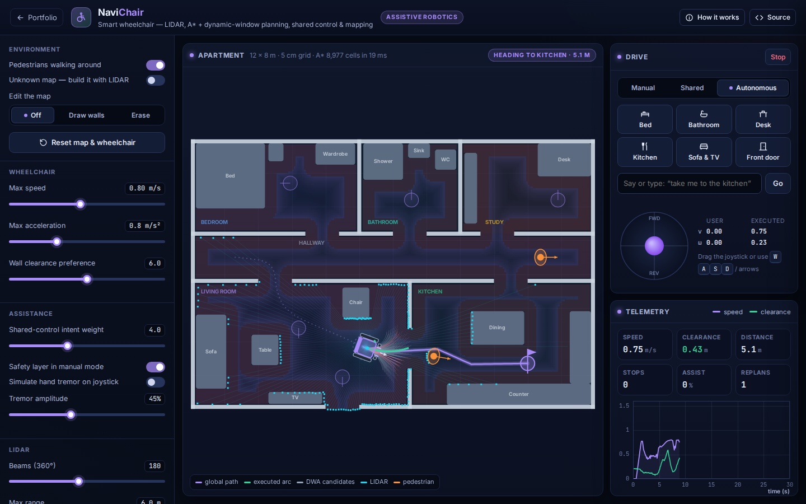
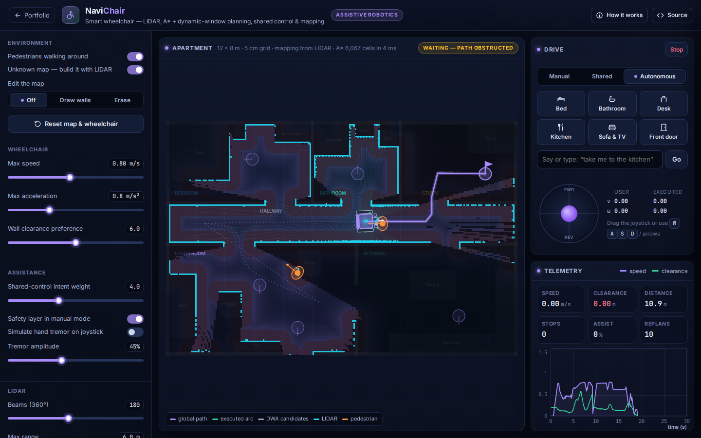

# NaviChair: Smart Wheelchair Shared-Control Navigator

**Assistive Robotics** · [▶ Live demo](https://safiullah-rahu.github.io/GPT-Applications/assistive-robotics/smart-wheelchair-navigator/) · [← Portfolio](../../README.md)

NaviChair simulates a powered wheelchair with a 360° LIDAR driving through a 12 × 8 m apartment with moving people.
It shows the navigation stack of an assistive mobility robot and the shared-control ideas that let users with limited
motor control drive safely: the chair helps, but the user stays in charge.

## Features

- **Perception**: LIDAR rays traced through a 5 cm occupancy grid with Amanatides–Woo traversal, intersected with walking pedestrians.
- **Costmap**: an exact Euclidean distance transform (Felzenszwalb–Huttenlocher) gives the clearance of every cell. Cells inside the chair
  radius are lethal, and beyond it an exponential penalty keeps comfortable distance from walls.
- **Global planning**: 8-connected A* with line-of-sight smoothing. The route is replanned when the map changes or it becomes blocked.
- **Local planning**:
  - Dynamic Window Approach: samples reachable (v, ω) pairs and rolls each arc 1.8 s ahead, rejecting any that would hit
    walls or predicted pedestrian positions.
  - Pure pursuit, docking and a recovery watchdog keep the chair moving through doorways.
- **Three control modes**:
  - *Manual*: joystick, with an optional safety layer.
  - *Shared*: the DWA picks the safe command closest to the user's intent, and optional simulated hand tremor is filtered out.
  - *Autonomous*: pick a room, or type a sentence such as "I'm hungry, take me to the kitchen".
- **Mapping mode**: start with an unknown map and build it with log-odds occupancy updates. Beams that hit people are filtered so they do not leave ghost walls.
- **Metrics**: speed, clearance, distance, stops, replans and *assistance*, which measures how much the controller intervened.

## How it works

| Piece | Method |
|---|---|
| Traversal cost | `cost(d) = ∞` if `d < r_robot`, otherwise `1 + w · exp(−(d − r) / 0.35)` |
| DWA score | `J = w_goal · d_goal + w_head · |Δθ| + w_clear · hinge(clearance) + w_speed · (v_max − v) [+ w_user · ‖u − u_user‖²]` |
| Mapping | per-beam log-odds updates: free along the ray, occupied at the hit |

## Things to try

1. Switch to *Shared* mode, turn on tremor and drive through a doorway with the arrow keys.
2. Draw a wall across the hallway while the chair is driving and watch it replan.
3. Turn on *Unknown map* and send the chair to the desk.
4. Raise the wall-clearance preference and compare the routes.

## Files

| File | Purpose |
|---|---|
| `nav-core.js` | Occupancy grid, ray casting, distance transform, costmap, A*, smoothing, DWA and log-odds mapping (no DOM, tested in Node) |
| `app.js` | Apartment world, pedestrians, controllers, command parser, rendering and telemetry |
| `index.html` | Layout and the in-app notes |
