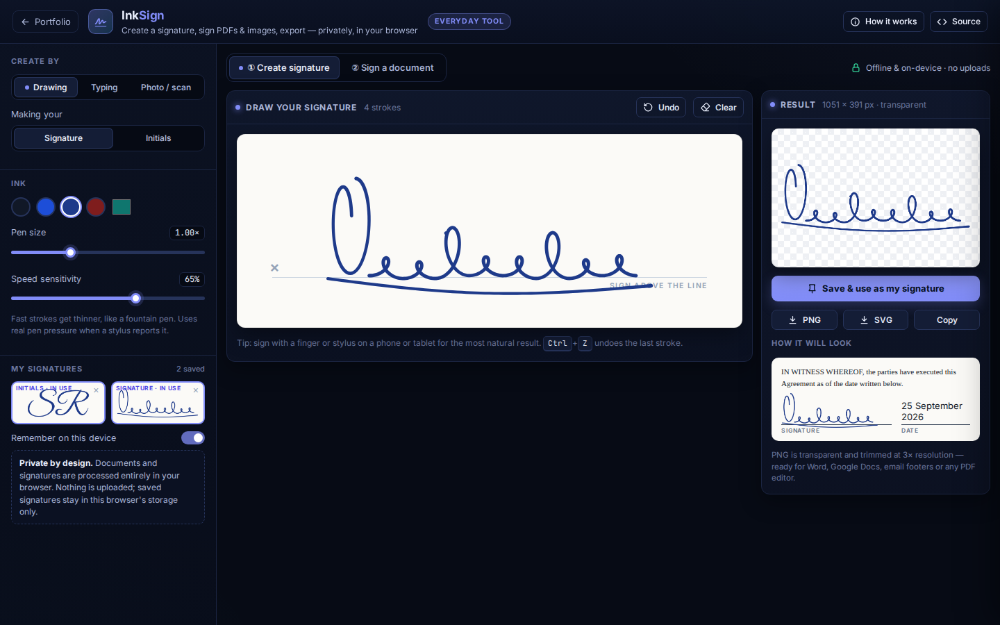
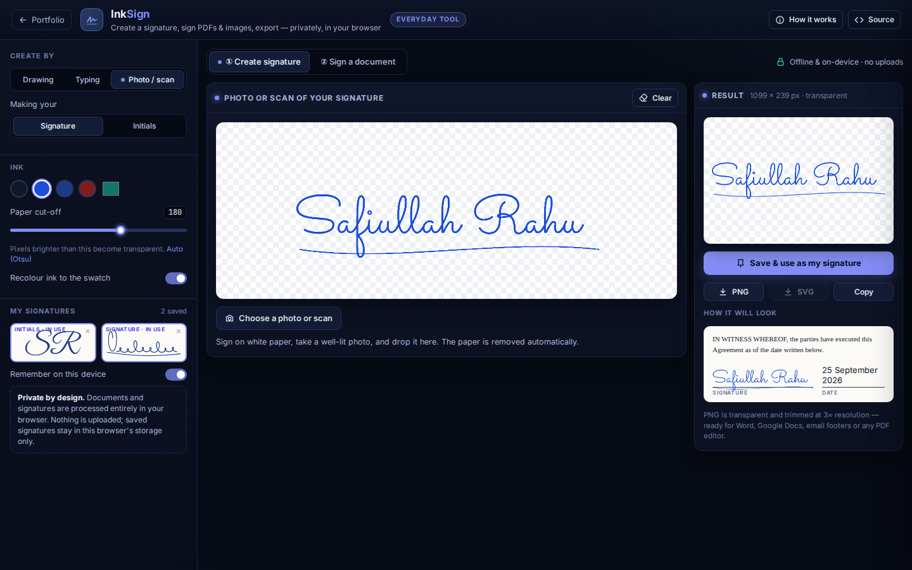

# InkSign: Create a Signature & Sign Documents

**Everyday Tools** · [▶ Live app](https://safiullah-rahu.github.io/AI-Applications/everyday-tools/inksign/) · [← Portfolio](../../README.md)

Someone emails you a lease, an offer letter or a school form: "please sign and return". Most online signing sites want an account and
your document on their servers, and many add watermarks or limit free use. InkSign does the everyday job in the browser: make your signature
once, sign any PDF or photo of a document, and download the result. **Files never leave your device.** The app works offline once loaded.

## Features

### Create a signature
- **Drawing**:
  - Mouse, finger or stylus input.
  - Speed-sensitive pen width (fast strokes are thinner, like a fountain pen), and stylus pressure when the device reports it.
  - Strokes are smoothed and stored as vector outlines.
  - Undo with <kbd>Ctrl</kbd>+<kbd>Z</kbd>.
- **Typing**: your name or initials in five handwriting typefaces (Great Vibes, Dancing Script, Allura, Sacramento, Caveat), with adjustable slant.
- **Photo / scan**: sign on paper and photograph it. InkSign then:
  - Flattens uneven lighting by dividing by a blurred background estimate.
  - Picks the paper/ink cut-off with Otsu's method (adjustable).
  - Makes the paper transparent, recolours the ink if you want, and trims to the ink.
- **Ink colours**: black, blue, navy, burgundy or any custom colour.
- **Exports**: a transparent, trimmed PNG (high resolution), SVG (for drawn signatures), or copy to the clipboard for Word, Google Docs or email.
- **Library**: signatures and initials are saved in this browser, and one click picks which to use. "Remember on this device" can be switched off.

### Sign a document
- Open a **PDF**, or a **JPG, PNG or WebP photo** of a paper document (converted to a PDF page with its orientation respected), by
  button or drag-and-drop. A built-in **sample contract** lets you try it immediately.
- Add fields: **signature, initials, name, date** (five formats), **free text** and **checkmarks**. Pick a tool and click the page,
  or Shift-click to place several.
- Drag to move, use the corner handle to resize, nudge with the arrow keys (<kbd>Shift</kbd> for 10 pt), and delete with <kbd>Del</kbd>.
  **Copy a field to all pages**, or **initial every page** in one click.
- **Download signed PDF**:
  - The original file is modified in place, so its text, links and pages are preserved.
  - Signatures are embedded as images; name, date and text are real PDF text (Helvetica). Non-Latin text such as Urdu or Arabic is embedded as an image.
  - Rotated and cropped pages are handled.
- **Signing certificate** (optional last page):
  - The signer's name and email.
  - The local time with its time zone, and the UTC time.
  - Every field, listed by page.
  - Signature specimens.
  - The **SHA-256 fingerprint of the original file**, with instructions to verify it.
- **Current page as PNG**: for when you need an image, or the PDF is encrypted against editing.
- Phone-friendly layout with a tool bar under the document.

## How it works

| Piece | Method |
|---|---|
| Pen width | `w = maxW − (maxW − minW)·min(1, v / v_ref)`, exponentially smoothed; `v` is the pen speed between samples |
| Stroke geometry | 3-point smoothing; left and right offset curves at ±w/2 along the normal, plus semicircular caps → one filled SVG path |
| Paper removal | `L' = 240·L / blur(L)` (illumination flattening) → Otsu threshold `t` → `α = clamp((t + 20 − L') / 45, 0, 1)` |
| Page geometry | fields are stored as fractions of the displayed page; on export they are mapped to PDF user space for rotation 0/90/180/270 and cropbox offsets, and content is rotated to read upright |
| Rendering / writing | [pdf.js](https://github.com/mozilla/pdf.js) 3.11 renders pages (lazily, in a web worker); [pdf-lib](https://github.com/Hopding/pdf-lib) 1.17 writes the signed file |
| Fingerprints | `crypto.subtle.digest('SHA-256', …)` of the original and signed bytes |

### Legal note
Many jurisdictions recognise simple electronic signatures for most everyday agreements (for example the US ESIGN Act and UETA, the EU's
eIDAS regulation and UK law), provided the parties intend to sign. Some documents, such as wills, certain property deeds and notarised papers,
may require wet ink, witnesses or a qualified signature. InkSign creates a *simple* electronic signature; it is **not** a certificate-based (PKI)
digital signature. This is not legal advice.

## Validation

Checked in [`tests/run-tests.js`](../../tests/run-tests.js):
- Pen width thins with speed and stays within its limits.
- Stroke outlines are closed, have the right thickness and have round caps.
- Otsu separates ink from paper, and clean-up makes the paper transparent and recolours the ink.
- The display ↔ PDF mapping is exact for all four page rotations with cropbox offsets.
- A placed, rotated box lands exactly on its on-screen footprint.
- Initials, date formats and hex helpers behave as expected.

End-to-end checks: exported PDFs were rendered back with pdf.js, including rotated and cropped pages, to confirm field positions.

## Files

| File | Purpose |
|---|---|
| `sign-core.js` | Pen model, stroke outlines, SVG export, ink clean-up, Otsu, trimming, page-coordinate mapping, date formats (no DOM, tested in Node) |
| `app.js` | Signature studio, library, document viewer, field editing, PDF export and signing certificate |
| `index.html` | Layout and the in-app notes |
| `vendor/` | pdf.js (Apache-2.0) and pdf-lib (MIT), with their licences |
| `fonts/` | Handwriting fonts (SIL OFL 1.1), see [`fonts/NOTICE.md`](fonts/NOTICE.md) |
