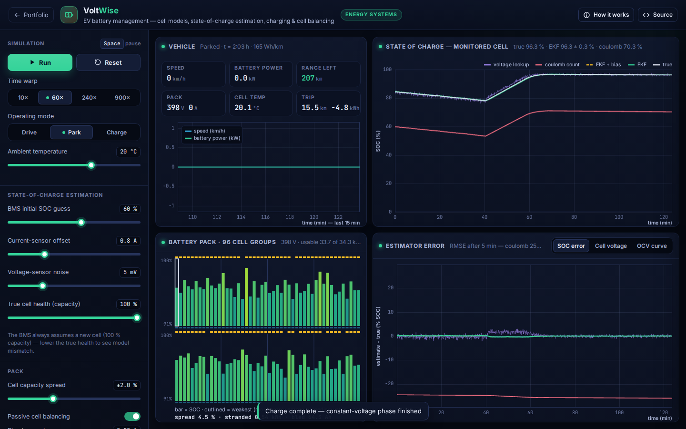

# VoltWise: EV Battery Management System Simulator

**Energy Systems** · [▶ Live demo](https://safiullah-rahu.github.io/AI-Applications/health-energy/battery-bms/) · [← Portfolio](../../README.md)

An EV's range estimate is only as good as its battery management system (BMS). State of charge cannot be measured
directly: it has to be *estimated* from noisy current and voltage sensors and a model of the cell. On top of that, a series
pack can only deliver what its weakest cell allows. VoltWise simulates a 96-cell pack in a car you drive through city,
highway and sporty cycles, and shows which BMS algorithms get the answer right.

## Features

- **Cell physics**:
  - First-order Thevenin model per cell group, with OCV(SOC) fitted by a monotone cubic.
  - Resistance that rises in the cold (Arrhenius) and at low SOC.
  - A lumped thermal model.
  - A manufacturing spread in capacity and resistance across 96 series cell groups.
- **Vehicle**: longitudinal dynamics (inertia, aerodynamic drag, rolling resistance), drivetrain and regeneration efficiency,
  cabin heating in the cold, and procedural city, highway and sporty drive cycles.
- **Four SOC estimators, live**:
  - Coulomb counting.
  - Voltage lookup (inverse OCV with IR compensation).
  - An extended Kalman filter with a ±3σ uncertainty band.
  - An EKF with an extra state that learns the current-sensor offset.
- **Fault injection**: wrong initial SOC, current-sensor offset, voltage noise, and an aged cell whose true capacity the BMS doesn't know.
- **Charging and balancing**: CC-CV charging (0.5 C, then 4.2 V on the highest cell) and passive bleed-resistor balancing, with the
  weakest-cell cut-off, stranded energy and balancing losses reported.
- **Views**: SOC traces, estimation error with RMSE, measured versus modelled cell voltage, the OCV curve, pack bars with temperature,
  and range from the EKF estimate and rolling consumption.

## How it works

| Piece | Method |
|---|---|
| Cell | `SOC' = −I/3600Q`, `v₁[k+1] = e^(−Δt/τ)·v₁[k] + R₁(1 − e^(−Δt/τ))·I`, `V = OCV(SOC) − v₁ − R₀(SOC, T)·I` |
| Vehicle | `P = (m·a + ½ρC_dA·v² + C_rr·m·g)·v / η` + auxiliaries; regeneration scaled by `η_regen` |
| EKF | state `[SOC, v₁]` (or `[SOC, v₁, b]`); prediction from the model, update with the terminal voltage through `H = [dOCV/dSOC, −1, (R₀)]` |
| Balancing | cells above the minimum SOC + 0.5 % bleed through a resistor at the chosen current |

## Validation

Checked in [`tests/run-tests.js`](../../tests/run-tests.js):
- The OCV interpolant passes through the data points, is monotone and has the right derivative.
- Ideal coulomb counting matches the model exactly.
- After a 20-point wrong start, EKF RMSE is under 2 % while coulomb counting stays over 15 % off.
- The bias-state EKF recovers a 2 A sensor offset.
- Balancing shrinks the cell spread.

## Files

| File | Purpose |
|---|---|
| `bms-core.js` | OCV curve, cell and thermal model, vehicle and drive cycles, estimators, pack and balancing (no DOM, tested in Node) |
| `app.js` | Live simulation loop, plots, pack view and controls |
| `index.html` | Layout and the in-app notes |
