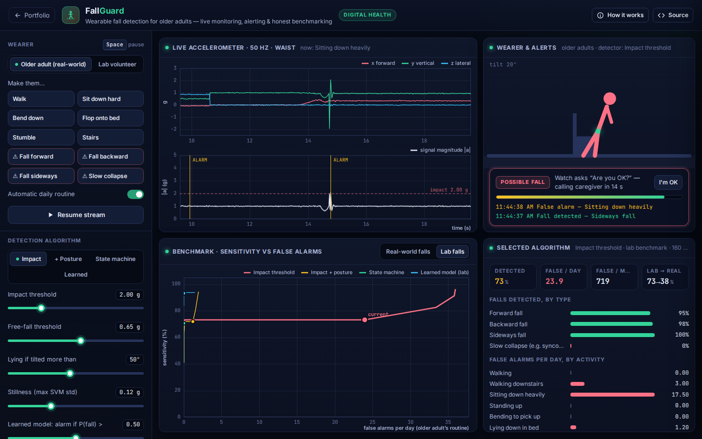

# FallGuard: Wearable Fall Detection & Alerting

**Digital Health** · [▶ Live demo](https://safiullah-rahu.github.io/AI-Applications/health-energy/fallguard/) · [← Portfolio](../../README.md)

Falls are a leading cause of injury in older adults, and a wearable that calls for help can shorten the time spent on the floor.
Published detectors often report high accuracy, but usually on *simulated* falls performed by young volunteers. When they were
evaluated on real falls of older adults, threshold algorithms averaged about 57 % sensitivity, with false alarms ranging from a few to
dozens per day ([Bagalà et al., PLOS ONE 2012](https://journals.plos.org/plosone/article?id=10.1371%2Fjournal.pone.0037062)).
FallGuard is a complete detection-and-alerting system you can stress-test against that reality.

## Features

- **Signal model**: a waist-worn tri-axial accelerometer at 50 Hz.
  - Daily activities: walking, stairs, sitting down heavily, standing up, bending, flopping onto a bed, stumbles.
  - Four fall types: forward, backward, sideways, and a slow collapse.
  - Falls have a descent (partial free-fall and rotation), an impact transient and an aftermath (lying still, moving, or getting up).
- **Two populations**:
  - *Lab*: young volunteers, hard impacts of 3–6.5 g.
  - *Real world*: older adults, often no free-fall, softer 1.5–3.8 g impacts, more slow collapses.
- **Four detectors**:
  - An impact threshold.
  - Impact + lying posture + stillness.
  - The classic low-power state machine (free-fall → impact → posture → stillness).
  - Logistic regression on six window features, trained on lab or real-world data.
- **Live monitor**: streaming axes and signal magnitude with the thresholds, an avatar driven by the estimated gravity vector, and
  one-click activities and falls.
- **Alert escalation**: "Are you OK?" countdown → cancel or caregiver call, with an incident log that also records missed falls.
- **Benchmark**: each algorithm's sensitivity vs *false alarms per day* curve (its threshold swept), current operating points,
  detection by fall type, false alarms by activity, and the lab → real-world sensitivity gap.

## How it works

| Piece | Method |
|---|---|
| Posture | gravity vector from the mean acceleration over 1 s; tilt = angle to the vertical axis |
| State machine | \|a\| < free-fall threshold → \|a\| > impact threshold within 1 s → after 2.5 s: tilt > limit and SVM std < stillness limit |
| Learned model | class-weighted, L2-regularised logistic regression on z-scored features of every candidate peak |
| False alarms/day | `Σ P(alarm \| activity) × occurrences per day` for an older adult's routine |

## Validation

Checked in [`tests/run-tests.js`](../../tests/run-tests.js):
- Simulated falls end horizontal after a multi-g impact.
- Every rule-based detector loses sensitivity from lab to real-world falls.
- Posture and stillness checks cut threshold false alarms by more than 4×.
- The threshold trade-off is monotone.
- The learned detector beats the state machine on real-world falls.

## Files

| File | Purpose |
|---|---|
| `fall-core.js` | Signal synthesis, detectors, features, logistic regression, datasets and evaluation (no DOM, tested in Node) |
| `app.js` | Live stream, avatar, alert escalation and benchmark views |
| `index.html` | Layout and the in-app notes |
