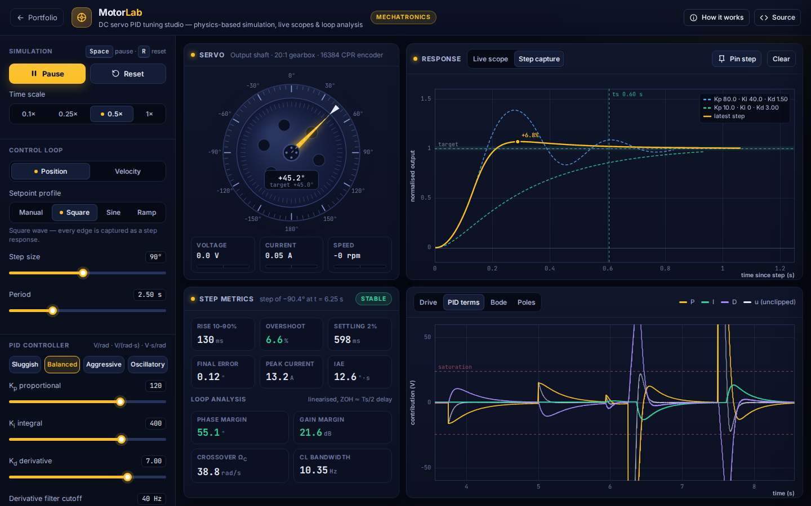
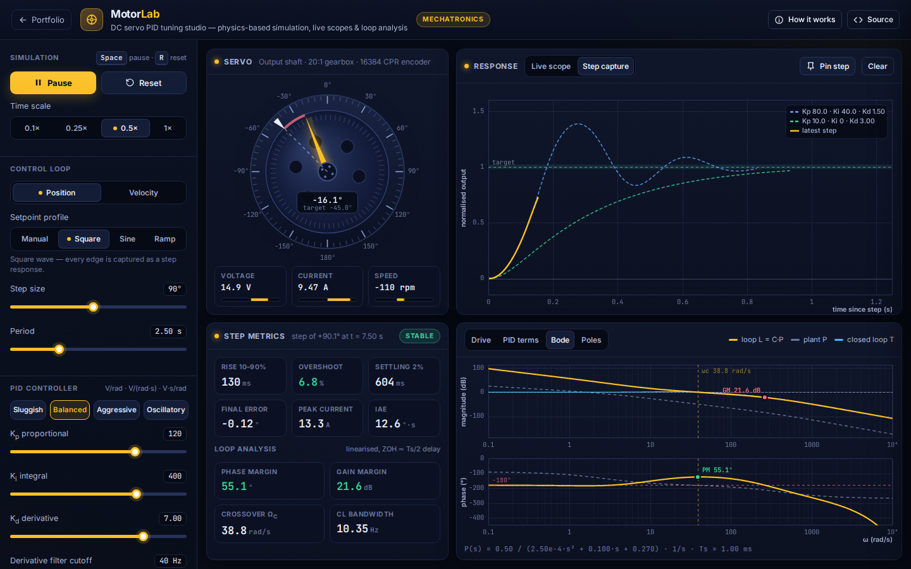

# MotorLab: PID Servo Tuning Studio

**Mechatronics** · [▶ Live demo](https://safiullah-rahu.github.io/GPT-Applications/mechatronics/pid-motor-lab/) · [← Portfolio](../../README.md)

MotorLab runs a physics-based simulation of a geared DC servo in real time and closes a digital PID loop around it.
Robot joints, 3-D printer axes, gimbals and electric actuators use the same architecture.
You can tune position and velocity loops by hand or with auto-tuners, and every step response is measured
and checked against a frequency-domain analysis of the loop.

## Features

- **Real-time plant**: electrical and mechanical dynamics integrated with RK4 at 20 kHz. The model includes Coulomb
  friction, supply-voltage saturation, encoder quantisation and sensor noise.
- **Digital PID** with derivative-on-measurement, a first-order derivative filter and conditional-integration anti-windup.
- **Scope and step capture**: every setpoint edge is captured and normalised. You can pin responses to compare tunings,
  and a live metrics panel reports rise time, overshoot, 2% settling time, steady-state error, peak current and IAE.
- **Loop analysis**: Bode plot with phase and gain margins, crossover and bandwidth. The closed-loop pole map is solved
  with a Durand–Kerner root finder, using a Padé approximation for the sampling delay.
- **Auto-tuning**:
  - Åström–Hägglund relay feedback, with Ziegler–Nichols, Tyreus–Luyben and other tuning rules.
  - A bump test that identifies a first-order-plus-dead-time model, followed by SIMC or pole-placement design.
- **Scenarios**: load-torque disturbances, gear/inertia changes, sample-rate changes and square, sine or ramp setpoints.

## How it works

| Piece | Method |
|---|---|
| Plant | `L·di/dt = V − R·i − K·ω`, `J·dω/dt = K·i − b·ω − τc·tanh(ω/ωs) − τload` |
| Controller | `u = Kp·e + I + D`. The integral term freezes while the output saturates, and D acts on the filtered measurement |
| Loop model | `L(jω) = C(jω)·P(jω)·e^(−jω·Ts/2)` (the zero-order hold is modelled as a half-sample delay) |
| Poles | roots of `1 + C·P·Padé(s)`, found by scaled Durand–Kerner iteration |
| Relay tuning | `Ku = 4d / (π√(a² − ε²))`, with `Tu` taken from the limit-cycle period |

## Things to try

1. Apply a load torque with a PD controller (Ki = 0) and note the steady-state error, then add integral action.
2. Drop the sample rate to 50 Hz and watch the phase margin shrink.
3. Turn anti-windup off and command a large step. The integrator winds up and the overshoot explodes.
4. Quadruple the inertia and run the relay auto-tuner again.

## Files

| File | Purpose |
|---|---|
| `motor-core.js` | Motor model, PID, step metrics, transfer functions, margins, polynomial roots and auto-tuning rules (no DOM, tested in Node) |
| `app.js` | UI, animation loop, scopes and analysis views |
| `index.html` | Layout and the in-app “How it works” notes |

Run it by opening `index.html`, or serve the repository root with `python3 -m http.server` and browse to `/mechatronics/pid-motor-lab/`.
