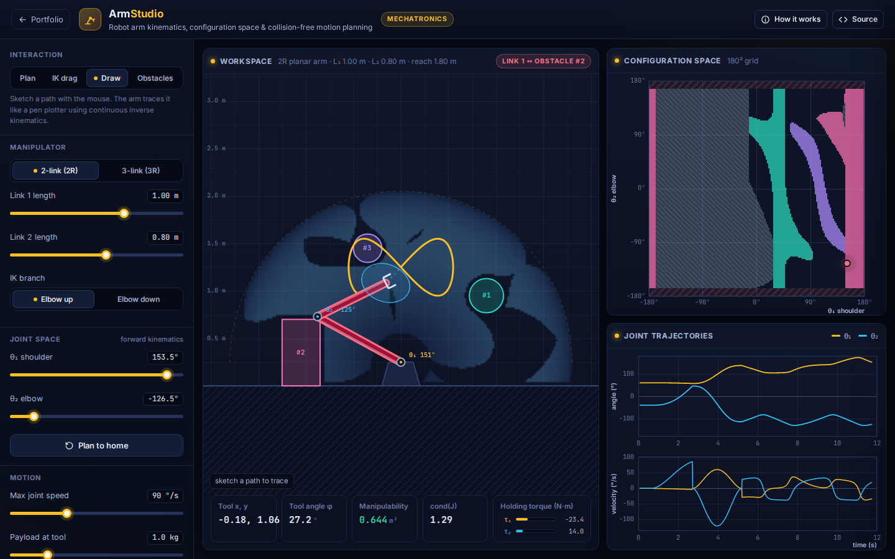

# ArmStudio: Robot Arm Kinematics & C-Space Planner

**Mechatronics** · [▶ Live demo](https://safiullah-rahu.github.io/GPT-Applications/mechatronics/robot-arm-studio/) · [← Portfolio](../../README.md)

ArmStudio models a planar serial manipulator (2R or 3R) on a pedestal. It links the three views a robotics engineer
works in: task space, joint space and configuration space. Click anywhere to plan a collision-free move, drag
the tool with inverse kinematics, reshape obstacles and see their configuration-space image update live.

## Features

- **Forward and inverse kinematics**:
  - Closed-form IK for 2R, with both elbow branches.
  - Wrist-point IK for 3R with a fixed tool angle.
  - Damped-least-squares IK for the redundant case.
- **Manipulability**: Yoshikawa index and velocity ellipse at the tool, plus a background map of the best collision-free
  manipulability for every reachable point.
- **Statics**: holding torques from `τ = Jᵀ F` for the link weights and the payload.
- **Configuration space**: exact C-space obstacles from capsule collision checks against circles, boxes, the floor and the pedestal.
  Each obstacle is colour-matched to its C-space image. For 3R, a slice at the current θ₃ is shown.
- **Motion planning**:
  - A* on an 8-connected 180² grid (2R) or a 26-connected 72³ lattice (3R), with lazy collision checks.
  - Shortcut smoothing, then quintic time scaling for zero velocity and acceleration at both ends.
- **Draw mode**: the arm traces your sketch through continuous IK, with arc-length re-parameterisation.

## How it works

| Piece | Method |
|---|---|
| FK | `x = x₀ + Σ Lᵢ cos(θ₁ + … + θᵢ)`, `y = y₀ + Σ Lᵢ sin(θ₁ + … + θᵢ)` |
| 2R IK | law of cosines, `θ₁ = atan2(dy, dx) − atan2(L₂ sin θ₂, L₁ + L₂ cos θ₂)` |
| DLS IK | `Δθ = Jᵀ (J Jᵀ + λ² I)⁻¹ e`, with step clamping and joint limits |
| Goal choice | every collision-free IK solution (both elbows and, for 3R, 72 tool angles); the closest one to the current pose wins |
| Time scaling | `s(τ) = 10τ³ − 15τ⁴ + 6τ⁵` |

## Things to try

1. Drag the dot in C-space straight into a coloured blob and watch the matching link turn red.
2. Stretch the arm fully in IK mode. The manipulability ellipse collapses to a line (a singularity).
3. Move an obstacle between the arm and a target, then plan again.
4. Switch to 3-link and plan into a tight gap.

## Files

| File | Purpose |
|---|---|
| `arm-core.js` | Kinematics, Jacobian, IK solvers, collision geometry, C-space rasterisation, N-D A*, smoothing and time scaling (no DOM, tested in Node) |
| `app.js` | Workspace, C-space and trajectory views, and the interaction modes |
| `index.html` | Layout and the in-app notes |
