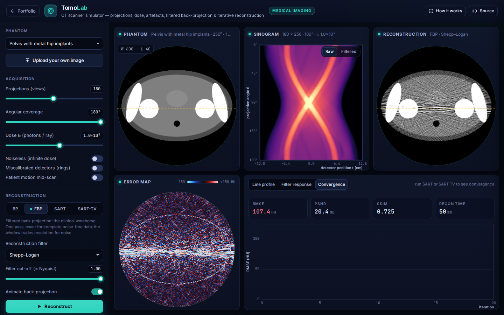

# TomoLab: CT Reconstruction Lab

**Medical Imaging** · [▶ Live demo](https://safiullah-rahu.github.io/AI-Applications/medical-imaging/ct-reconstruction-lab/) · [← Portfolio](../../README.md)

TomoLab reproduces the imaging chain of a parallel-beam CT scanner: object → X-ray projections → noisy measurements →
reconstruction → image-quality assessment. You can change the dose, the number of views and the angular coverage,
add artefacts, and compare filtered back-projection with iterative reconstruction. Error maps and metrics are shown alongside.

## Features

- **Phantoms**: thorax, Shepp–Logan, a pelvis with metal hip implants and resolution bars. You can also upload your own image.
- **Exact projections**: analytic Radon transforms of ellipses and rectangles avoid the "inverse crime". Uploaded
  images use a ray-driven bilinear projector.
- **Physics**:
  - Poisson photon noise, where dose sets I₀.
  - Photon starvation behind metal.
  - Miscalibrated detectors, which cause rings.
  - Patient motion mid-scan.
- **Filtered back-projection** with the exact band-limited ramp kernel (Kak & Slaney), windowed by Ram-Lak, Shepp–Logan, cosine,
  Hamming or Hann. An optional animation shows the image being back-projected view by view.
- **Iterative reconstruction**: OS-SART with ordered subsets, and SART-TV, which interleaves total-variation descent in the ASD-POCS style.
- **Image quality**: RMSE in HU, PSNR and SSIM inside the field of view, a signed error map, line profiles, filter responses and convergence plots.

## How it works

| Piece | Method |
|---|---|
| Projection | ellipse chord `p(θ, t) = ρ · 2ab √(a²(θ) − s²) / a²(θ)`, with `a²(θ) = a² cos²(θ − α) + b² sin²(θ − α)` |
| Noise | `N ~ Poisson(I₀ e^(−p))`, `p̂ = −ln(N / I₀)` |
| FBP | `f(x, y) = Δθ · Σₖ (pₖ ∗ h)(x cos θₖ + y sin θₖ)` |
| SART | `x ← x + λ Cₛ⁻¹ Aₛᵀ Rₛ⁻¹ (pₛ − Aₛ x)`, `x ≥ 0`, over 10 ordered subsets |
| TV | gradient steps on the smoothed total variation, scaled to the SART update size |

## Things to try

1. Drop to 30 views and compare FBP streaks with SART-TV.
2. Lower the dose to 10³ and switch the filter from Ram-Lak to Hann.
3. Load the hip phantom. Classic metal streaks appear at clinical doses.
4. Restrict coverage to 120° to see limited-angle artefacts.

## Files

| File | Purpose |
|---|---|
| `ct-core.js` | Phantoms, analytic and numeric projectors, noise, filters, FBP, OS-SART and TV (no DOM, tested in Node) |
| `app.js` | Pipeline scheduling, rendering, windowing, upload and plots |
| `index.html` | Layout and the in-app notes |
