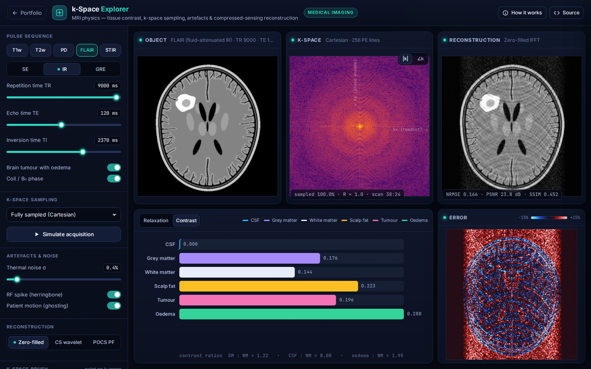

# k-Space Explorer: MRI Physics & Reconstruction

**Medical Imaging** · [▶ Live demo](https://safiullah-rahu.github.io/GPT-Applications/medical-imaging/mri-kspace-explorer/) · [← Portfolio](../../README.md)

An MRI scanner never measures an image directly. It samples the Fourier transform of the transverse magnetisation, called k-space.
k-Space Explorer simulates the chain from tissue relaxation physics to image reconstruction. You can design pulse-sequence
contrast, choose or paint which k-space samples are acquired, inject artefacts and reconstruct undersampled data.

## Features

- **Procedural brain phantom**: scalp, diploë, CSF, folded cortex with sulci, white matter, basal ganglia, ventricles and an optional
  tumour with oedema. It is stored as partial-volume tissue fractions, with relaxation times at 1.5 T.
- **Pulse sequences**: spin echo, inversion recovery (FLAIR, STIR) and gradient echo, with one-click T1w, T2w, PD, FLAIR and STIR presets
  and live relaxation curves at the chosen TR and TE.
- **k-space**: centred 2-D FFT of the complex image, with coil/B₀ phase. It shows magnitude and phase, a scan-time estimate and an animated acquisition.
- **Sampling**:
  - Full, low-pass and high-pass.
  - Uniform R× (parallel-imaging style) with an auto-calibration region.
  - Variable-density random, radial spokes and partial Fourier.
  - Or erase and paint k-space with a brush.
- **Artefacts**: RF spike (herring-bone), motion (phase-encode ghosts) and thermal noise.
- **Reconstruction**: zero-filled inverse FFT, compressed sensing (FISTA with a 4-level Haar wavelet prior) and POCS partial Fourier,
  with NRMSE, PSNR, SSIM and signed error maps.

## How it works

| Piece | Method |
|---|---|
| Spin echo | `S = PD · (1 − e^(−TR/T1)) · e^(−TE/T2)` |
| Inversion recovery | `S = PD · |1 − 2e^(−TI/T1) + e^(−TR/T1)| · e^(−TE/T2)` |
| Gradient echo | `S = PD · sin α · (1 − E1) / (1 − cos α · E1) · e^(−TE/T2*)` |
| Compressed sensing | FISTA on `min ½‖M F x − y‖² + λ‖Ψ x‖₁`, where `Ψ` is a Haar wavelet transform |
| Partial Fourier | POCS with the phase estimated from the low-resolution k-space centre |

## Things to try

1. Click FLAIR. CSF goes dark and the oedema lights up.
2. Pick uniform undersampling with R = 3 to see fold-over aliasing, then switch to random sampling with CS.
3. Brush-erase the centre of k-space and watch the contrast disappear.
4. Simulate a T2 acquisition and note the scan time.

## Files

| File | Purpose |
|---|---|
| `mri-core.js` | Tissue model, phantom, signal equations, centred FFT, masks, artefacts, Haar wavelets, FISTA and POCS (no DOM, tested in Node) |
| `app.js` | Staged pipeline, brush, scan animation, physics plots and UI |
| `index.html` | Layout and the in-app notes |
